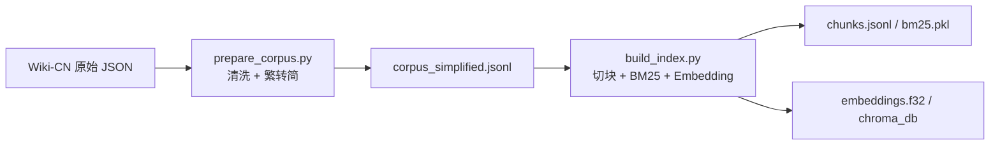
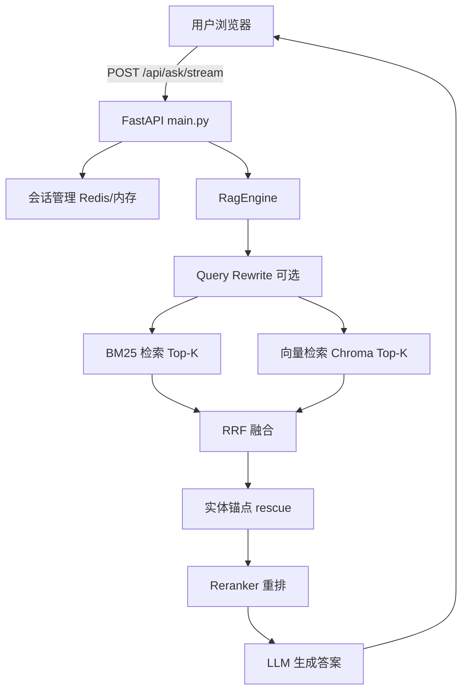

# Wiki-CN RAG 问答系统 · 面试准备指南

> 基于 `qa_web/` 项目代码与 README 整理，适用于软件开发实习生面试。

---

## 目录

- [一、开场 1～2 分钟项目介绍（必背版）](#一开场-12-分钟项目介绍必背版)
- [二、技术栈（分层说明）](#二技术栈分层说明)
- [三、项目运行流程（从 0 到用户提问）](#三项目运行流程从-0-到用户提问)
- [四、开发中遇到的问题与解决（STAR 格式）](#四开发中遇到的问题与解决star-格式)
- [五、面试官可能问的问题 + 参考答案](#五面试官可能问的问题--参考答案)
- [六、面试表达建议](#六面试表达建议)
- [七、30 秒 / 2 分钟 / 5 分钟三个版本](#七30-秒--2-分钟--5-分钟三个版本)

---

## 一、开场 1～2 分钟项目介绍（必背版）

> **面试官：先介绍一下这个项目。**

**答：**

我做的是一个基于 **中文维基百科（Wiki-CN）** 知识库的 **RAG 问答系统**。

**背景与目标：** Wiki-CN 有约 130 万条百科条目、2GB 文本。直接让大模型回答容易幻觉，所以我用 RAG：先从本地知识库检索相关段落，再交给 LLM 生成答案，并给出参考文献。

**我负责的部分：** 从数据处理、索引构建，到后端 API、前端聊天界面和系统可观测性，基本是端到端完成的。

**核心能力：**

- **混合检索**：BM25（关键词）+ 向量检索（ChromaDB + BGE-M3），用 RRF 融合
- **重排序**：本地 BGE-Reranker 提升相关性
- **生成**：主通道阿里云百炼 qwen-plus，本地 Ollama 作备用
- **Web 界面**：类 ChatGPT 的多会话聊天，支持流式输出

**规模：** 索引约 **290 万** chunk，服务启动后可在浏览器里对百科知识提问。

**一句话总结：** 这是一个「本地百科知识库 + 混合检索 + 大模型生成」的完整 RAG 应用，而不只是调 API 的 Demo。

---

## 二、技术栈（分层说明）

| 层次 | 技术 | 作用 |
|------|------|------|
| **后端框架** | FastAPI + Uvicorn | REST API、页面渲染、流式响应 |
| **前端** | HTML + CSS + 原生 JS | 聊天 UI、多会话、localStorage 持久化 |
| **模板** | Jinja2 | 服务端渲染首页、健康检查页 |
| **数据校验** | Pydantic | 请求/响应模型 |
| **语料处理** | OpenCC | 繁体转简体 |
| **分词/检索** | jieba、rank-bm25、SentencePiece | BM25 稀疏检索 |
| **向量库** | ChromaDB（HNSW） | 稠密向量持久化检索 |
| **Embedding** | BGE-M3（本地 sentence-transformers） | 查询/文档向量化 |
| **Reranker** | BGE-Reranker-v2-m3（CrossEncoder） | 精排 |
| **LLM** | 阿里云百炼（OpenAI 兼容 API）、Ollama | 答案生成 |
| **会话存储** | Redis（可选）/ 进程内存 | 后端多轮对话历史 |
| **配置** | python-dotenv | `.env` 环境变量 |
| **评测** | RAGAS + LangChain | 离线 RAG 质量评估 |

**面试加分说法：** Embedding 和 Reranker 尽量本地跑，降低 API 成本；生成走云端保证质量；检索和生成解耦，便于分别优化。

---

## 三、项目运行流程（从 0 到用户提问）

### 阶段 A：离线构建（一次性/增量）



1. **`prepare_corpus.py`**：读 wiki-cn 原始文件 → 清洗（去控制字符、零宽字符）→ OpenCC 转简体 → 输出 `corpus_simplified.jsonl`（支持 `--resume` 断点续跑）
2. **`build_index.py`**：按标题/句子切块 → 建 BM25 索引 → BGE-M3 批量 Embedding → 写入 ChromaDB
3. **产物**：`chunks.jsonl`、`bm25.pkl`、`chroma_db/`、`embeddings.f32`（向量缓存，用于重建）

**常用命令：**

```powershell
# 生成简体语料
python scripts/prepare_corpus.py --data-root ../wiki-cn --output ./build/corpus_simplified.jsonl

# 构建索引
python scripts/build_index.py --corpus ./build/corpus_simplified.jsonl --build-dir ./build --embed-model bge-m3 --base-url http://127.0.0.1:11434/v1 --resume --keep-emb-cache
```

### 阶段 B：在线服务



**启动：**

```powershell
conda activate ai_course
cd qa_web
python -m uvicorn app.main:app --host 0.0.0.0 --port 8000 --access-log --log-level info
```

**启动特点：** RAG 引擎在**后台线程**异步加载（chunks → BM25 → Chroma → LLM 客户端），页面可先打开；失败则指数退避重试。

**一次问答：**

1. 前端带 `session_id`、`question`、`allow_web` 调 `/api/ask/stream`
2. 后端取最近 N 轮历史（最多 5 轮）
3. `RagEngine.retrieve()`：混合检索 → 实体锚点补充 → Rerank → 取 Top 6
4. 本地证据不足且允许联网时，SerpAPI 补充
5. 把 Top 3 证据（每段约 320 字）拼进 Prompt，流式调用 LLM
6. 返回答案 + 参考文献；会话写入 Redis 或内存

**可观测：**

```text
http://127.0.0.1:8000/api/health?format=json
```

重点字段：`engine_phase`、`index_ntotal`、`last_trace.timing_ms`、`last_vec_used`、`last_rerank_used`。

---

## 四、开发中遇到的问题与解决（STAR 格式）

### 问题 1：ChromaDB 索引损坏，`index_ntotal=0`

**现象：** health 显示向量索引为 0，或报 `Error loading hnsw index`。

**原因：** Chroma 的 SQLite 元数据在，但 HNSW 向量文件不完整（例如只有 `index_metadata.pickle`，缺少 `header.bin` 等）。

**解决：**

- 用已有 `embeddings.f32` 跑 `rebuild_chroma_from_cache.py` 重建
- 后端缓存 `index_ntotal`，避免 health 每次慢 count
- 启动时分阶段加载并上报 `engine_stage`

**面试说法：** 大索引构建易中断，我保留了 embedding 缓存和重建脚本，把「可恢复构建」当作工程能力的一部分。

**重建命令：**

```powershell
python scripts/rebuild_chroma_from_cache.py --build-dir ./build --emb-cache ./build/embeddings.f32 --chroma-dir ./build/chroma_db --collection-name wiki_cn_dense
```

---

### 问题 2：服务启动慢，用户长时间白屏

**现象：** 290 万 chunk + BM25 + Chroma，冷启动要几分钟。

**解决：**

- 后台 daemon 线程加载，`engine_phase`: idle → loading → ready
- 分阶段 ETA（EMA 平滑预测剩余时间）
- 加载未完成时 API 返回友好提示，而不是崩溃
- 加载失败指数退避重试（10s → 180s 上限）

**面试说法：** 大模型应用里「冷启动」是典型工程问题，我用异步加载 + 状态机 + 健康检查，而不是阻塞 `startup`。

---

### 问题 3：答案对但参考文献不相关（「牛头不对马嘴」）

**现象：** LLM 答案还行，但 references 是无关百科条目。

**原因：** 混合检索对「谁创办了 X」「X 的原名是什么」等事实问法，语义检索容易偏。

**解决：**

- **实体锚点（Anchor Rescue）**：从问题抽核心实体（如「阿里巴巴」「原名」），在 title 索引里精确匹配补召回
- **锚点优先排序**：参考文献按实体匹配强度重排
- **Reranker**：CrossEncoder 对 query-doc 精排
- **公开引用过滤**：候选完全不命中核心实体时不硬展示无关引用
- 排查链路：`last_trace.anchor_terms`、`anchor_rescue_used`、`last_rerank_used`

**面试说法：** RAG 质量不只看生成，检索召回和排序同样关键；我加了规则 + 模型的混合策略。

---

### 问题 4：响应延迟高

**现象：** 首 token 和总耗时偏长。

**解决（配置权衡）：**

- 默认关 Query Rewrite、Multi-hop（少一次 LLM/检索）
- 只送 Top 3 证据、每段 320 字给 LLM
- `LLM_MAX_TOKENS=160` 控制生成长度
- Rerank 只对 Top 6 候选
- health 的 `timing_ms` 定位瓶颈（`llm_ms` / `rerank_ms` / `vector_ms`）

**面试说法：** 我在延迟和质量之间做了可配置权衡，并用 trace 做性能分析，而不是盲目加功能。

---

### 问题 5：Redis 未启动

**现象：** 启动报 `Redis 连接失败，退回本地内存`。

**解决：** Redis 可选；连不上自动降级进程内存存会话。前端历史仍在 `localStorage`，核心问答不受影响。

**面试说法：** 外部依赖要有 graceful degradation，保证核心路径可用。

---

### 问题 6：LLM / Embedding 偶发超时

**解决：** 失败计数 + cooldown（例如连续失败 2 次后冷却 60～90 秒）；LLM 主备切换（百炼 → Ollama → 抽取式兜底）。

---

## 五、面试官可能问的问题 + 参考答案

### 基础认知类

#### Q1：什么是 RAG？你为什么用 RAG 而不是直接问大模型？

**A：** RAG 是 Retrieval-Augmented Generation：先检索相关知识，再让模型基于证据生成。Wiki 事实类问题若只靠模型预训练，容易幻觉或过时；RAG 能引用本地百科、给出处，可控、可更新（重建索引即可），也更符合「知识库问答」场景。

---

#### Q2：BM25 和向量检索有什么区别？为什么做混合检索？

**A：**

- **BM25**：稀疏检索，擅长精确词匹配（人名、专有名词、 rare token）
- **向量检索**：语义相似，擅长 paraphrase（「谁创立」≈「创始人是谁」）
- 单一方式有短板；我用 **RRF（Reciprocal Rank Fusion）** 融合两路排名，互补召回，再 Rerank 精排。

---

#### Q3：RRF 是怎么工作的？

**A：** 不直接比 BM25 分和向量分（量纲不同），而是看排名：

```text
score = 1/(k+rank_bm25) + 1/(k+rank_vector)
```

k 通常取 60。两路都靠前的文档融合分更高。实现见 `app/rag_engine.py` 的 `_rrf_merge`。

---

#### Q4：Reranker 和 Embedding 检索有什么不同？

**A：** Embedding 是双塔：query 和 doc 分别编码再算相似度，速度快但交互弱。Reranker（CrossEncoder）把 query 和 doc 拼一起打分，更准但更慢。所以我先 hybrid 召回 Top 24，再 Rerank Top 6，平衡速度与质量。

---

#### Q5：你的语料是怎么切块的（Chunking）？

**A：** 先按 Markdown `##` 标题分块，过长再按句子切，必要时字符窗口（带 overlap）控制长度。这样 chunk 尽量语义完整，又不超过 embedding 上下文。

---

### 架构与工程类

#### Q6：系统架构是怎样的？

**A：** 三层：

1. **数据层**：Wiki-CN → 清洗语料 → chunks + BM25 + Chroma
2. **服务层**：FastAPI，`RagEngine` 封装检索与生成，`main.py` 管 API、会话、引擎生命周期
3. **展示层**：类 ChatGPT 前端，流式 NDJSON，localStorage 多会话

---

#### Q7：为什么用 FastAPI？

**A：** 异步友好、Pydantic 校验、OpenAPI 文档、StreamingResponse 做流式输出，Python AI 生态（numpy、chromadb、sentence-transformers）集成方便。实习项目够用且易维护。

---

#### Q8：流式输出怎么实现的？

**A：** 后端 `/api/ask/stream` 返回 `application/x-ndjson`，`RagEngine.stream_answer()` 逐 chunk yield；前端 `fetch` + `ReadableStream` 逐行解析，边收边渲染。LLM 不可用则一次性返回抽取式答案。

---

#### Q9：多轮对话怎么做的？

**A：** 两层：

- **前端**：`localStorage` 存会话列表和消息
- **后端**：按 `session_id` 存最近 N 轮（user+assistant），Redis 或内存，TTL 24h

生成时把 history 拼进 prompt，支持追问。默认限制 5 轮，控制 token 和干扰。

---

#### Q10：如果 LLM 挂了怎么办？

**A：** 三级降级：

1. 主通道百炼 qwen-plus
2. 备用 Ollama 本地模型
3. **抽取式答案**：直接取 Top1 证据前两句话

还有 failure threshold + cooldown，避免反复超时拖垮服务。

---

### 深度追问类（加分）

#### Q11：290 万向量怎么存的？检索性能如何？

**A：** ChromaDB PersistentClient + HNSW。向量离线批量写入，在线只对 query embedding 后 ANN 检索。大索引下 `collection.count()` 很慢，所以 count 结果缓存，health 不每次全量 count。向量检索慢时可调低 `TOP_K_VECTOR` 或临时 `FORCE_BM25_ONLY=1` 做对比。

---

#### Q12：Embedding 为什么本地跑，LLM 为什么上云？

**A：** 检索对每个问题都要 embedding，调用量大，本地 BGE-M3 成本低、延迟可控。生成对质量要求高，云端 qwen-plus 效果更好；本地 Ollama 作备用。职责分离，便于分别优化成本和体验。

---

#### Q13：你怎么评估 RAG 效果？

**A：** 写了 `scripts/evaluate_rag.py`，用 RAGAS（faithfulness、answer relevancy 等），测试集 `eval_dataset.jsonl`，裁判模型用 qwen-max。线上用 health trace + 人工抽测：先看 references 是否相关，再判断答案是检索问题还是生成问题。

---

#### Q14：Query Rewrite 和 Multi-hop 是什么？为什么默认关闭？

**A：**

- **Query Rewrite**：用 LLM 改写/query 扩展，提升检索，但每问多一次 LLM 调用
- **Multi-hop**：根据首轮结果构造 follow-up query 再检索，适合复杂推理

默认面向简单事实问答，为延迟和成本关闭；调试复杂追问时可开。体现功能开关和场景化配置。

---

#### Q15：实体锚点 rescue 是什么思路？

**A：** 从问题模板抽核心实体（「X 是谁创办的」→ X），在 `title_to_rows` 索引里精确/模糊匹配标题，补进候选。这是针对百科场景的 **规则增强检索**，弥补纯向量对专名的不足。不是写死单题规则，而是覆盖常见事实问法模式。

---

#### Q16：如果让你继续优化，会做什么？

**A：**（选 2～3 个说即可）

- 增量索引更新（`update_index.py` 已有基础）
- 缓存热门 query 的检索结果
- 更细的分块策略（按段落语义）
- 用户反馈（点赞/点踩）闭环优化
- 容器化部署（Docker + Redis）
- 更完整评测集与 A/B 对比 hybrid vs BM25-only

---

### 行为 / 项目 ownership 类

#### Q17：这个项目你独立完成的还是团队合作？

**A：**（按实际情况说，可参考）

我独立完成从数据处理、索引构建、RAG 链路、FastAPI 后端到前端界面的主要开发。过程中查阅 RAG、Chroma、BGE 文档，通过 health 接口和 README 记录运维经验，方便后续维护。

---

#### Q18：遇到的最大困难是什么？

**A：**（用 Chroma 索引损坏 + 检索质量，二选一深入）

最大困难是 Chroma HNSW 不完整导致向量检索失效。一开始只有 count=0，排查发现元数据和向量文件不一致。我保留 embedding 缓存、写重建脚本，并在 health 暴露 `dense_ready`、`index_ntotal`，把「可诊断、可恢复」做进系统。这个过程让我理解：ML 项目里数据和索引 pipeline 和模型同样重要。

---

#### Q19：为什么简历写这个项目？

**A：** 它覆盖完整软件链路：数据 ETL、信息检索、LLM 应用、Web 服务、可观测性和降级策略。对实习岗位能体现工程能力，不只是调包；也有真实规模（百万级 chunk）和可演示的 UI。

---

## 六、面试表达建议

1. **先业务后技术**：Wiki 知识问答 → RAG → 混合检索 → 生成，别一上来堆名词。
2. **准备 1 个 Demo 故事**：例如问「阿里巴巴是谁创办的」，讲检索 → 锚点 → 生成 → 参考文献。
3. **诚实边界**：实习生可说「Reranker / RRF 参考业界方案，我负责集成、调参和工程落地」；被追问 RRF 公式、CrossEncoder 原理要能答上。
4. **别背配置数字**：可以说「Top-K、context 长度可配置，默认偏延迟优化」；细节看 health trace。
5. **安全**：API Key 在 `.env`，不提交仓库——若被问到部署，主动提这一点。

---

## 七、30 秒 / 2 分钟 / 5 分钟三个版本

### 30 秒

Wiki-CN 百科 RAG 问答：BM25+向量混合检索、Rerank、百炼生成，FastAPI 后端 + 聊天前端，290 万 chunk，含健康检查与流式输出。

### 2 分钟

使用本文 [第一节](#一开场-12-分钟项目介绍必背版) 的开场介绍即可。

### 5 分钟

开场 + 技术栈 + 运行流程 + 1～2 个问题与解决（Chroma 重建 + 检索质量优化）。

---

## 附录：简历项目描述参考（3～5 行）

```text
Wiki-CN RAG 问答系统 | Python / FastAPI / ChromaDB
- 基于 130 万条中文维基语料，构建 BM25 + BGE-M3 混合检索与 Rerank 精排链路，索引规模约 290 万 chunk
- 实现 FastAPI 后端与类 ChatGPT 流式聊天前端，支持多会话、健康检查与 LLM 主备降级
- 针对大索引冷启动、Chroma 索引损坏、检索引用不准等问题，设计异步加载、索引重建脚本与实体锚点增强检索
```

---

## 附录：关键 API 一览

| 接口 | 方法 | 说明 |
|------|------|------|
| `/` | GET | 聊天首页 |
| `/api/ask` | POST | 同步问答 |
| `/api/ask/stream` | POST | 流式问答（NDJSON） |
| `/api/ask/clear` | POST | 清空会话历史 |
| `/api/health` | GET | 健康检查（支持 `?format=json`） |

---

## 附录：排查「答案不准」速查

1. 打开 `/api/health?format=json`
2. 看 `references` 是否相关（检索问题 vs 生成问题）
3. 查 `last_trace.rewrite_queries`、`anchor_terms`、`anchor_rescue_used`
4. 查 `last_vec_used`、`last_rerank_used`
5. 查 `last_trace.timing_ms` 判断性能瓶颈
6. 测试时用「新会话」，避免历史上下文干扰
